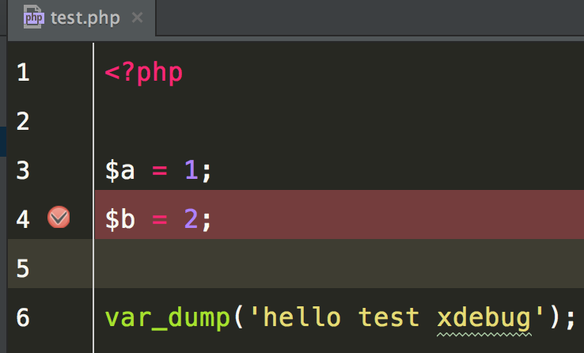

# Xdebug with vagrant

## 設定使用 vagrant php 執行 xdebug

在設定 Preferences / Languages & Framework / PHP 中

指定 vagrant 的位置與執行的 php 位置


## 確認 php 有支援 xdebug

若設定正確，可以在 General 區塊中看到 `Debugger: Xdebug 2.4.0`

> Homestead 的 Vagrant 預設皆有安裝 Xdebug


## 設定 vagrant 中的 xdebug 套件

使用 `vagrant ssh` 進入虛擬機後，編輯 `/etc/php/7.0/cli/conf.d/20-xdebug.ini` 檔案，使用下列設定

```sh
zend_extension=xdebug.so
xdebug.remote_enable=1
xdebug.remote_connect_back = 1
xdebug.remote_port = 9000
```


## 設定 debug 環境

執行 phpstorm debug


debug 參數設定


新增 PHP Web Application


新增伺服器


伺服器新增完成


## 開始 debug

設定程式中斷點



重新執行 debug


debug test.dev


執行測試後將會看到後面帶有 `XDEBUG_SESSION_START` 的參數在後面，這樣 xdebug 才能抓到需要 debug 的頁面，網址會像是

> `http://test.dev/test.php?XDEBUG_SESSION_START=11023`

到 chrome 開啟此網址後，會看到頁面被中斷掉

重新回到 phpstorm 看 xdebug 測試結果


